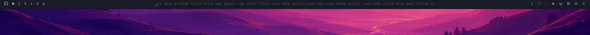
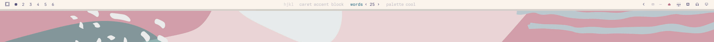
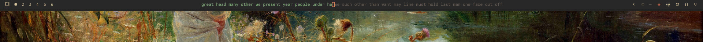
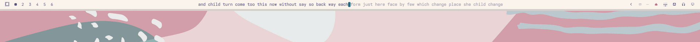
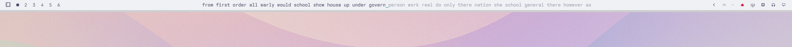

# Omatype

A typing test that takes over your [Omarchy](https://omarchy.org) bar.



Any mistake ends the run. There is no backspace.

---

## Install

```bash
omarchy plugin add https://github.com/jamesd7788/omatype.git
omarchy plugin enable io.github.jamesd7788.omatype
```

Bind a key in `~/.config/hypr/bindings.lua`:

```lua
o.bind("SUPER + SHIFT + M", "Typing test",
       "omarchy-shell io.github.jamesd7788.omatype toggle")
```

`SUPER+SHIFT+M` is Omarchy's Music binding — `hl.unbind` it first, or pick
another chord. Omatype never touches your keybindings itself.

Remove it with `omarchy plugin remove io.github.jamesd7788.omatype`.

Needs Omarchy 4.x. Nothing else.

---

## Keys

| | |
|---|---|
| `tab` | restart |
| `esc` | quit |
| `backspace` | settings |

The clock starts on your first keystroke.

---

## Records

Your best wpm is kept per word count — beat it and the result line says so,
with a pixel shockwave across the bar. Only a completed run counts: a failed
one reports the speed it reached, which is not a result.

---

## Settings



`hjkl` or arrows, and everything wraps. Persists to
`~/.local/state/omarchy/type-config.json`.

| option | values |
|---|---|
| caret | underline · outline · accent block · soft tint · invert |
| words | 10 · 25 · 40 |
| palette | default · vivid · random |

---

## Themes

It wears whatever theme you're running and follows a theme change live.







The three palettes are resolved by measurement against your theme's
`colors.toml`, not by naming colours:

| | |
|---|---|
| `default` | foreground, a measured dim for untyped, accent caret |
| `vivid` | typed in the theme's primary, untyped at full foreground strength |
| `random` | drawn from the theme's own swatches, reseeded every test |

Typed text always clears WCAG AA against the field, untyped always stays
visible and a clear step from typed — that boundary is the only cursor the
test has. Naming roles instead was the first attempt and does not survive
real themes: a theme assigns ANSI slots for terminal compatibility, not by
hue, so `cyan` is pink in rose-pine and grey in matte-black.

---

## Notes

The bar's layer surface has `keyboardFocus: None`, so a bar widget can never
see a keystroke. This is a separate strip on the same edge that takes an
exclusive grab for the length of a run. `OnDemand` focus doesn't work here —
the pointer is never over a 20px strip, so every key goes to the window
underneath instead.

The line is measured, not estimated. Word widths are cached per font and the
assembled line is checked against the field before it's dealt.

```
Type.qml      panel, keyboard grab, rendering, record burst
Engine.js     typing state machine
Settings.js   options, records, persistence
Palette.js    colors.toml parsing, contrast measurement
```

```bash
test/run      # 512 assertions, no dependencies
```

---

## Licence

MIT. `english.json` is the 200 most common English words, as used by
[Monkeytype](https://github.com/monkeytypegame/monkeytype), minus `I` — the
only capital in the list, and a shift reach mid-burst ends your run.

See also [omarchy-type](https://github.com/jamesd7788/omarchy-type), the same
idea as a full web app.
