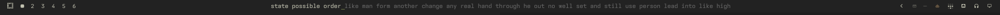
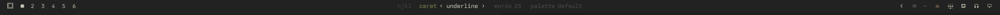

# Omatype

A typing test that takes over your status bar.

Press a key and the middle of your [Omarchy](https://omarchy.org) bar becomes a
one-line typing test in your current theme. Type it, get your wpm, and the bar
goes back to being a bar. The whole thing lasts about eight seconds.



One caveat up front: **any mistake ends the run.** There is no backspace. It is
Monkeytype's master mode and nothing else, because a test that lives in a 26px
strip has no room to show you a mistake you could go back and fix.

---

## Install

```bash
omarchy plugin add https://github.com/jamesd7788/omatype.git
omarchy plugin enable jamesd7788.omatype
```

Then bind a key. In `~/.config/hypr/bindings.lua`:

```lua
o.bind("SUPER + SHIFT + M", "Typing test", "omarchy-shell jamesd7788.omatype toggle")
```

`SUPER+SHIFT+M` is Omarchy's Music binding, so take a free chord instead if you
use it — `hl.unbind(...)` first if you do want to claim it. The plugin never
touches your keybindings itself.

Requires Omarchy 4.x (the Quickshell shell). No other dependencies.

---

## Keys

| | |
|---|---|
| any character | type the line |
| `tab` | restart, mid-run or from the results |
| `esc` | quit |
| `backspace` | settings |

The clock starts on your first keystroke, not when the words appear, so your
reaction time stays out of your wpm.

The test takes an exclusive keyboard grab while it is up — every key goes to
the bar and not to your focused window. It releases on `esc`, when a run ends,
and on its own after ten seconds of no typing, so it cannot strand your
keyboard.

---

## Settings

`backspace` opens a config strip in the same space.



`h` `l` move between options, `j` `k` change a value, arrow keys work too, and
everything wraps. `backspace`, `esc` or `enter` leaves and deals a fresh test
with the new settings. Choices persist to
`~/.local/state/omarchy/type-config.json`.

| option | values |
|---|---|
| caret | underline · outline · accent block · soft tint · invert |
| words | 10 · 25 · 40 |
| palette | default · contrast · subtle · warm · cool · mono |

40 words under master rules is about 220 characters where one slip at the end
loses all of it. It is there if you want it.

---

## Theming

The test wears whatever Omarchy theme you are running, and follows a theme
change live — no restart.

The palette presets do **not** introduce colours. They remap which role in your
theme's existing palette gets used for each part of the test:

```js
{ name: "warm", typed: "cyan", pending: "muted", caret: "orange" }
```

Those are role names, resolved against the active theme's `colors.toml` when
the line is painted. So `warm` is warm relative to whatever you are running,
and a preset picked under one theme still works under the next one. Roles carry
fallback chains, so a theme that omits `bright_foreground` or `cyan` still
renders.

---

## How it works

The bar is a Wayland layer-shell surface created with `keyboardFocus: None`. A
widget inside it can never receive a keystroke, and the bar is Omarchy-owned
code that should not be edited. So this is not a bar widget: it is a separate
layer-shell strip, the same height as the bar, parked on the same screen edge
and covering the middle 80%. It looks like the bar because it is drawn like the
bar; the slivers at each end stay click-through so your real widgets keep
working.

Two things are worth knowing if you are hacking on it.

**The keyboard grab is `Exclusive` for the whole run**, not the
`Exclusive`-then-`OnDemand` settle that the shell's own `KeyboardPanel` uses.
That panel is full-screen, so `OnDemand` still finds the pointer inside it.
This one is a 20px strip the pointer is essentially never over, and under
`OnDemand` every keystroke goes to the window underneath instead. Measured: not
a single key arrived.

**The line is measured, never estimated.** Deriving a character count from an
average glyph advance ran about 30% long and painted words over the real bar's
widgets — `Style.fontFamily` is the alias `monospace`, and the width
`TextMetrics` reports for it does not match what a `Text` item renders. Word
widths are measured once and cached per font, and the assembled line is checked
against the field before it is dealt.

### Layout

| | |
|---|---|
| `Type.qml` | the panel: surface, keyboard grab, rendering, config strip |
| `Engine.js` | the typing state machine — pure functions, no QML |
| `Settings.js` | option lists, cycling, persistence shape |
| `Palette.js` | `colors.toml` parsing and role resolution |
| `english.json` | the word list |

The three `.js` files are `.pragma library` modules with no QML dependencies,
which is what lets the test suite run them under node.

### Tests

```bash
test/run
```

84 assertions over the engine, settings and palette resolution. No
dependencies — the runner shims the `.pragma library` files into ES modules and
imports the real source, so there is no second copy to drift. It checks the
rules that decide a run (first wrong character ends it, the clock starts on the
first keystroke, wpm counts correct characters while raw counts every
keystroke) and that every palette preset resolves against your actual installed
theme and stays readable.

The QML layer is not covered; it needs a live compositor.

---

## See also

[omarchy-type](https://github.com/jamesd7788/omarchy-type) — the same idea as a
full-page web app, with timed modes, live wpm and a results screen. This is its
small, rude sibling.

---

## Licence

GPL-3.0-or-later, because `english.json` is vendored from
[Monkeytype](https://github.com/monkeytypegame/monkeytype), which is GPL-3.0.
Everything else was written from scratch — this is not a fork of Monkeytype and
shares none of its code.
